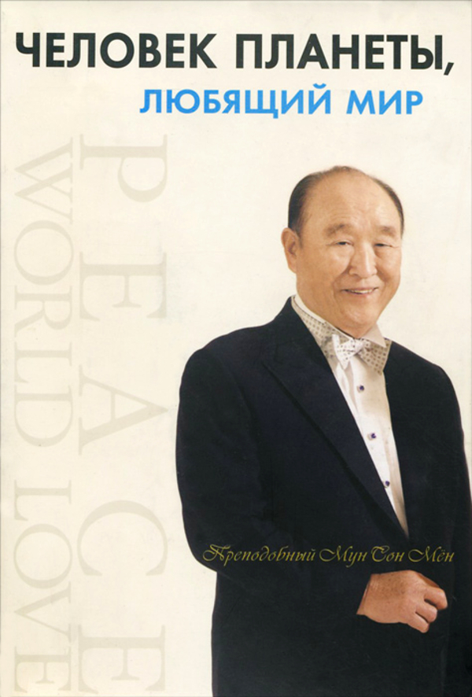

<html lang="ru">
    <head>
        <meta charset="UTF-8">
        <link rel="stylesheet" href="global-style.css">
        <link rel="stylesheet" href="tf-style.css">
        <link rel="stylesheet" href="tf-style-mob.css">
        <link href="https://fonts.googleapis.com/css2?family=Kaushan+Script&family=Montserrat&display=swap" rel="stylesheet">
        <link rel="icon" type="image/png" href="icons/owl.png"/>
    </head>
    <body>
        <header class="header">
            

                
vadym.adv@gmail.com

                
&nbsp;

                

                    
                    
                
                     
            

        </header>
        <section class="content">
            

                
                
                

                    <h2 class="custom" id="gs">Автобиография "Человек планеты, любящий мир"</h2>
                    
В своей автобиографии, ставшей бестселлером в Корее, преподобный Мун Сон Мён делится воспоминаниями о богатой событиями жизни: об истории своей семьи и о детстве, о школьных годах и о Божьем призыве в возрасте 15 лет, о жестоких преследованиях и тюремных заключениях, о создании Церкви Объединения и начале миссионерской работы по всему миру, о бракосочетании с г-жой Мун Хан Хак Джа и о важности института семьи и брака, а также о своем страстном стремлении к объединению Кореи и построению мира на земле.

Преподобный Мун рассказывает о ряде проектов в сферах образования, культуры, искусства и спорта, о природоохранных и океанических предприятиях, а также смело заглядывает в будущее человечества и передает свое послание к молодежи.

                    
<iframe  class="responsive-iframe" src="https://www.youtube-nocookie.com/embed/urslhdjxDYA" frameborder="0" allow="accelerometer; autoplay; clipboard-write; encrypted-media; gyroscope; picture-in-picture" allowfullscreen></iframe>
 <!--width="620" height="375" -->
                
<a href="https://forms.gle/txkci3X1aJAq9n2H8" target="_blank">Хочу купить</a>

                

            

        </section>
    </body>
</html>
